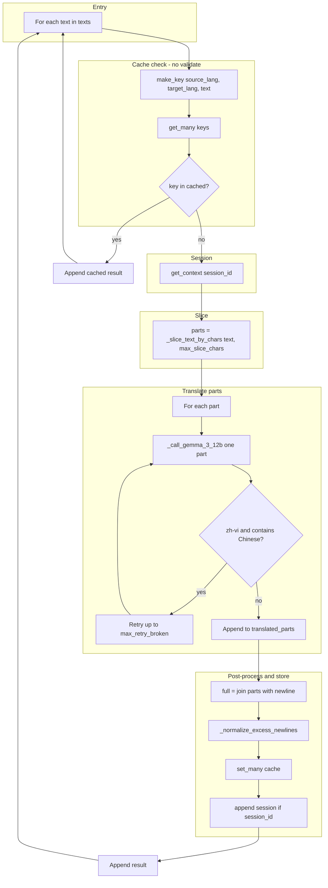
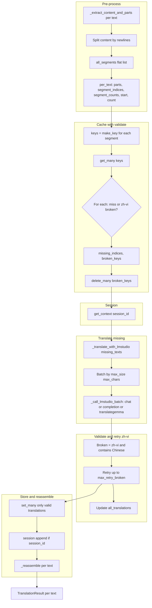

# Translation API Pipeline

This document describes the end-to-end translation flow, the two pipelines (Gemma-3-12b vs General), and a logic review.

---

## 1. High-level flow

```
Client  -->  API (GET/POST)  -->  translate_batch  -->  Model check
                                                           |
                                    +----------------------+----------------------+
                                    |                                             |
                              Gemma-3-12b?                                  General
                                    |                                             |
                            _translate_batch_gemma                    _translate_batch_general
                                    |                                             |
                                    v                                             v
                            Cache (no validate)                         Pre-process segments
                            Slice by chars                              Cache (with validate)
                            Translate parts + retry                     Translate missing + retry
                            Post-process, cache set                    Reassemble
                                    |                                             |
                                    +----------------------+----------------------+
                                                           v
                                                    List[TranslationResult]
                                                           v
                                                    _build_plain_response  -->  Client
```

- **Entry:** `POST /language/translate/v2` or `GET /language/translate/v2`.
- **Branch:** `translator.translate_batch` checks `_is_gemma_pipeline_model(settings)` (model name contains `"gemma"` and does not contain `"translategemma"`). If true → Gemma pipeline; else → General pipeline.
- **Output:** Both pipelines return `List[TranslationResult]`; API returns plain text (single string or newline-joined).

---

## 2. API layer

### 2.1 Session ID resolution (stateful when client has no session)

When the client does **not** send a `session_id`, the server derives one from the client IP so that context is still kept per client:

- **Helper:** `_resolve_session_id(session_id, request)` in `api.py`.
- If `session_id` is provided and non-empty → use it as-is.
- Otherwise → use client IP: `request.client.host`, or the first IP from `X-Forwarded-For` / `X-Real-IP` (when behind a proxy), normalized. Session key format: `ip:{client_host}` (e.g. `ip:192.168.1.1`) so it does not collide with client-provided IDs.

Both POST and GET use this before calling `translate_batch`, so every request has a `session_id` when the client is reachable (translator still accepts `None` if no client info).

### 2.2 POST /v2

| Step | Code | Description |
|------|------|-------------|
| Body | `TranslateRequest`: `q` (str or list), `source`, `target`, `session_id` | Single text → `texts = [body.q]`; list → `texts = body.q`. |
| Session | `session_id = _resolve_session_id(body.session_id, request)` | Use body session or derive from client IP. |
| Call | `translator.translate_batch(..., session_id=session_id)` | One call per request. |
| Response | `_build_plain_response(translations)` | One result → that string; multiple → join with `\n`. |

### 2.3 GET /v2

| Step | Code | Description |
|------|------|-------------|
| Params | `q`, `text`, `sl`/`tl`, `from`/`to`, `source`/`target`, `session_id` | Source: `sl or from_ or source or "auto"`. Target: `tl or to or target` (required). |
| Build `texts` | If `q`: `texts = q`. If `text`: **Gemma model** → `texts = [text]` (raw, no split). **Other** → `texts = [line for line in text.splitlines() if line.strip()]`. | Gemma gets one block; others get one item per non-empty line. |
| Session | `resolved_session_id = _resolve_session_id(session_id, request)` | Use query session or derive from client IP. |
| Call | Same `translate_batch(texts, source=src, target=tgt, session_id=resolved_session_id)`. | |
| Response | Same `_build_plain_response`. | |

So for Gemma, GET with `?text=...` always sends one text; the translator then does cache/slice/translate per that one text.

---

## 3. Model check and dispatch

**File:** `translator.py` – `TranslatorService.translate_batch`

```python
if not texts:
    return []
source_lang = source or self._settings.default.source_lang
target_lang = target or self._settings.default.target_lang
if _is_gemma_pipeline_model(self._settings):   # "gemma" in model and "translategemma" not in model
    return await self._translate_batch_gemma(texts, source_lang, target_lang, session_id)
return await self._translate_batch_general(texts, source_lang, target_lang, session_id)
```

- No shared state between the two pipelines; each returns `List[TranslationResult]`.

---

## 4. Gemma-3-12b pipeline

**Method:** `_translate_batch_gemma(texts, source_lang, target_lang, session_id)`

### 4.1 Flow diagram



### 4.2 Steps (per text)

| Step | Description | Config / code |
|------|-------------|----------------|
| 1. Cache lookup | Key = `source_lang|target_lang|text`. `get_many([key])`. **No validation** of cached value. | `cache.get_many` |
| 2. Hit | If `key in cached`, append `TranslationResult(cached[key])` and continue to next text. | |
| 3. Empty text | If `not text.strip()`, return same text, no cache write, continue. | |
| 4. Session context | If `session_id` and `session_store`: `session_context = session_store.get_context(session_id)`. Used in every LM call. | `session.max_entries`, `max_chars`, `ttl_seconds` |
| 5. Slice | `parts = _slice_text_by_chars(text, max_slice_chars)`. **Smart slice**: each part ≤ `max_slice_chars`, splitting at natural boundaries (paragraph `\\n\\n` > line `\\n` > sentence `.?!。？！…` > clause `;，；`) to avoid breaking context. If no break in window, force cut. If result empty, `parts = [text]`. | `gemma.max_slice_chars` (default 2000) |
| 6. Translate each part | For each part: call `_call_gemma_3_12b([part], ...)`. zh-vi: if output `_contains_chinese`, retry up to `max_retry_broken`. Use last output if still broken. | `gemma.max_retry_broken` (default 3) |
| 7. Concat | `full = "\n".join(translated_parts)`. | |
| 8. Post-process | `full = _normalize_excess_newlines(full)` (collapse 3+ newlines to 2, strip). | |
| 9. Cache write | `set_many({key: full})`. No validation. | |
| 10. Session append | If `session_id`: `session_store.append(session_id, [(text, full)])`. | |
| 11. Result | Append `TranslationResult(text=full)`. | |

### 4.3 LM call (Gemma)

- **Method:** `_call_gemma_3_12b(batch, source, target, context)`.
- **Prompt:** `_build_system_prompt_gemma_3_12b` → template key `gemma_3_12b_{source_lang}_{target_lang}` or `gemma_3_12b_default`.
- **Request:** One request per batch item: `messages = [system, user]` with `user.content = text` (raw, no extra instructions).
- **Response:** For each item: `content` from `choices[0].message.content`, then `_normalize_excess_newlines(content)`.

---

## 5. General pipeline

**Method:** `_translate_batch_general(texts, source_lang, target_lang, session_id)`

### 5.1 Flow diagram



### 5.2 Steps

| Step | Description | Config / code |
|------|-------------|----------------|
| 1. Pre-process | For each text: `_extract_content_and_parts(text)` (split by `<...>` tags). For each content part: `splitlines()` → segments. Build `all_segments` (flat) and `per_text` (parts, segment_indices, segment_counts, start, count). | |
| 2. No segments | If `all_segments` is empty, return one result per text (original text). | |
| 3. Session context | Same as Gemma: `get_context(session_id)` if session_id and store. | |
| 4. Cache lookup | `keys = [make_key(source_lang, target_lang, s) for s in all_segments]`, `cached = get_many(keys)`. | |
| 5. Validate cache | For each index: if key not in cached → missing. If key in cached and zh-vi and `_contains_chinese(cached[key])` → broken: add to `broken_keys` and treat as missing. Then `delete_many(broken_keys)`. | `batch.max_retry_broken` |
| 6. Translate missing | `missing_texts = [all_segments[i] for i in missing_indices]`. Call `_translate_with_lmstudio(missing_texts, ...)`. | |
| 7. Batch LM | `_translate_with_lmstudio` batches by `max_size` (and `max_chars`). `max_size = max(1, max_size)` to avoid infinite loop. Then `_call_lmstudio_batch` → chat, completion, or translategemma (no Gemma-3-12b here; general uses chat/completion/translategemma). | `batch.max_size`, `batch.max_chars`, `batch.zh_vi_max_size` |
| 8. Retry broken | zh-vi: collect indices where `_contains_chinese(new_translations[j])`. Retry those segments up to `max_retry_broken`; update `all_translations`. | |
| 9. Cache write | Only translations that pass validation (not zh-vi broken): `set_many(cache_updates)`. | |
| 10. Session append | Append `(segment, translation)` for all missing_indices. | |
| 11. Reassemble | For each text: `_reassemble(parts, segment_indices, slice_trans, segment_counts)` to put translations back into tag structure. | |
| 12. Result | One `TranslationResult` per input text. | |

### 5.3 LM call (General)

- **Batching:** `_translate_with_lmstudio`: `max_size = max(1, zh_vi_max_size or max_size)`, `max_chars`. Loop: fill batch until size/char limit, then `_call_lmstudio_batch(batch, ...)`.
- **Backend choice:** `_call_lmstudio_batch`: if `"translategemma"` in model → `_call_translategemma`; if `"gemma"` in model and `"translategemma"` not in model → `_call_gemma_3_12b`. Else chat or completion by `endpoint_type`.
- **Chat:** `_call_lmstudio_chat`: system prompt from `_build_system_prompt` (key `{source}-{target}` or default). User: single or numbered list; zh-vi prepends "Translate each line below...". Parse response by lines, strip numbers, pad/truncate to batch length.

---

## 6. Cache and session

### 6.1 Cache (`cache.py`)

| Method | Behavior |
|--------|----------|
| `make_key(source_lang, target_lang, text)` | `f"{source_lang}|{target_lang}|{text}"`. |
| `get_many(keys)` | Returns `{k: self._data[k] for k in keys if k in self._data}`. |
| `set_many(entries)` | Update and persist to file. |
| `delete_many(keys)` | Pop keys and persist if any removed. |

- **Gemma:** One key per full input text. No validation on read; write after post-process.
- **General:** One key per segment (after extract + splitlines). Validate on read (zh-vi: delete if Chinese in value); write only valid translations.

### 6.2 Session (`session_context.py`)

| Method | Behavior |
|--------|----------|
| `get_context(session_id)` | If missing or TTL expired, return `""`. Else last N pairs (by `max_entries`), trimmed by `max_chars`, formatted as "Previous translations...". |
| `append(session_id, pairs)` | Append (source, target) pairs; create entry if new; trim to `max_entries`. |

- Used in both pipelines when `session_id` is provided; context is prepended to system prompt in LM calls.

---

## 7. Config summary

| Section | Key | Used in |
|---------|-----|--------|
| lmstudio | model, base_url, endpoint_type | Model check, LM calls. |
| batch | max_size, max_chars, zh_vi_max_size, max_retry_broken | General: batching and retry. |
| gemma | max_slice_chars, max_retry_broken | Gemma: slice size and per-part retry. |
| cache | persistent_file | Cache path. |
| session | max_entries, max_chars, ttl_seconds | Session store. |
| prompts | default, zh-vi, gemma_3_12b_zh_vi, gemma_3_12b_default | System prompts. |

---

## 8. Logic review

### 8.1 Correctness

| Check | Status | Note |
|-------|--------|------|
| Empty `texts` | OK | `translate_batch` returns `[]` immediately. |
| Gemma cache | OK | No validate; hit → return cached. Miss → translate, validate output (zh-vi), retry, then cache. No stale “broken” cache. |
| General cache | OK | Validate zh-vi; broken entries deleted and re-translated. Only valid translations cached. |
| General infinite loop | OK | `max_size = max(1, max_size)` so batch always advances; `start` increases. |
| Gemma slice | OK | `_slice_text_by_chars` uses smart boundaries (paragraph/line/sentence/clause); empty list fallback `[text]`. |
| Gemma retry | OK | Per-part loop; break on first valid (non-Chinese for zh-vi); else use last after max_retry. |
| Session | OK | Both pipelines get context once per request and append after translating; session created on first append. |
| GET text vs Gemma | OK | When model is Gemma, GET builds `texts = [text]` so one item; Gemma pipeline runs with one text. |

### 8.2 Edge cases

| Case | Behavior |
|------|----------|
| `session_id` None | Session context is `""`; no append. |
| Very long single text (Gemma) | Sliced by `max_slice_chars`; each part translated and joined. |
| All segments empty (General) | After pre-process, `all_segments` can be empty → return original texts. |
| zh-vi retry exhausted | General: broken translations still in `all_translations`, not cached. Gemma: last attempt output used and cached. |

### 8.3 Data flow summary

- **Gemma:** `texts` → per text: cache key → hit → result; miss → session context → slice → translate parts (with retry) → concat → post-process → cache set → session append → result.
- **General:** `texts` → pre-process → `all_segments`, `per_text` → cache (with validate) → missing → translate in batches → validate/retry → cache set → session append → reassemble per text → result.

Both pipelines return the same type and count of results as input `texts`; the API then formats them as plain text for the client.
